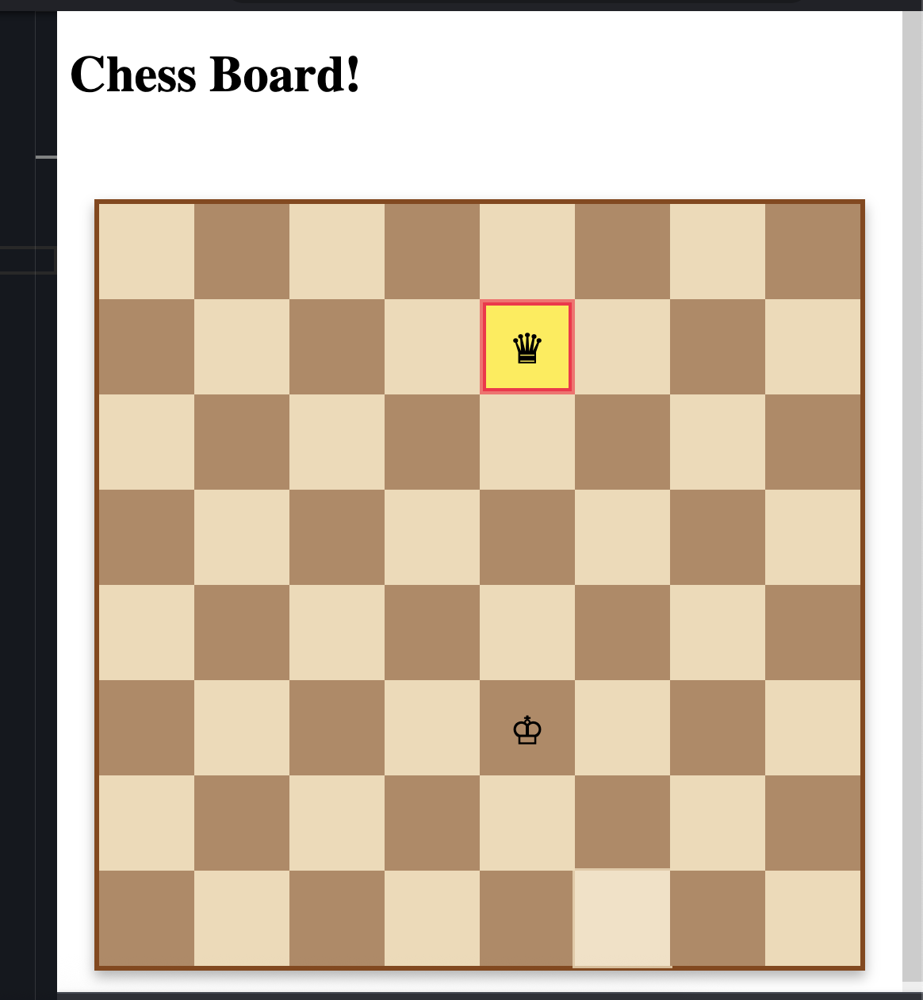

# Chess Board Game

A simple two-player chess board game built with Angular, featuring only kings that can move one square in any direction.

## Features

- 8x8 chess board with alternating colors
- Two kings: White King (♔) and Black King (♛)
- Turn-based gameplay
- Visual selection highlighting
- Hover effects and smooth animations

## How to Play

1. **White goes first** - Click on the White King (♔) to select it
2. **Move the king** - Click on any adjacent square (one square in any direction)
3. **Turns alternate** - After White moves, it's Black's turn
4. **Continue playing** - Keep alternating turns between players

## Game Rules

- Kings can only move **one square** in any direction (horizontal, vertical, or diagonal)
- Players must alternate turns
- Only the current player's king can be selected and moved
- Selected pieces are highlighted with a yellow background and red border

## Installation

1. Clone the repository
2. Run `npm install`
3. Run `ng serve`
4. Navigate to `http://localhost:4200`

## Technologies Used

- Angular
- TypeScript
- CSS Grid
- Unicode chess symbols

## File Structure
src/
├── app/
│ ├── app.component.ts # Game logic
│ ├── app.component.html # Board template
│ └── app.component.css # Styling

